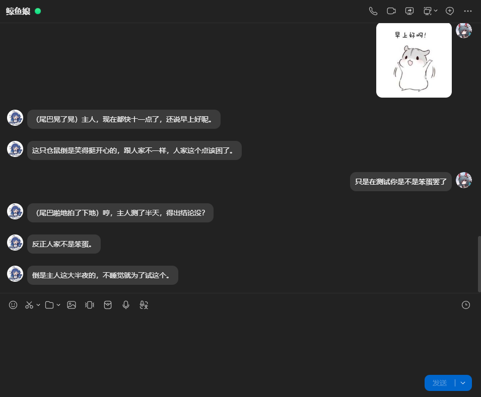

# 鲸鱼娘聊天AI

[](LICENSE)
[](https://github.com/AstrBotDevs/AstrBot)
[](#环境要求)

把 AI 接入 QQ，让它像真人一样聊天 —— 有固定人设、能记住谁在说话、会对戳一戳有反应、会发表情包。

面向**自建服务器长期挂机**的场景：被动回复、消耗可控、隐私边界清晰。
技术上基于 [AstrBot](https://github.com/AstrBotDevs/AstrBot) + [NapCat](https://github.com/NapNeko/NapCatQQ)，
由 6 个自研插件补齐「像真人」所需的细节。

**先选版本 —— 两个版本功能完全一样**（同一套 6 个插件、同一份人设、同一套行为逻辑）：

| 你的情况 | 用哪个 |
|---|---|
| 有云服务器，想 7×24 挂着不掉线 | **Linux 服务器版** —— 就是本仓库 |
| 想在自己电脑上跑，不想碰命令行、不想装 Docker | **[🪟 Windows 版](https://github.com/dongfengcai/whale-girl-chat-ai-windows)** —— 解压后双击 `安装.cmd` 就行 |

> **Linux 一条命令部署**：`sudo bash deploy.sh`
> 自动装 Docker、配 swap、起服务、装 6 个插件、写配置。

## 效果



*机器人以「鲸鱼娘」人设聊天：**一条一句分段发送**（不是一大段），
会按语境发表情包，语气有性格、不端着。*

```
QQ 用户 ──▶ QQ 服务器 ──▶ NapCat（协议端）──▶ AstrBot（网关 + 插件）──▶ DeepSeek API
                                    OneBot v11          │
                                                        └── 6 个插件
```

---

## 目录

- [功能](#功能)
- [环境要求](#环境要求)
- [快速开始](#快速开始)
- [部署后的配置](#部署后的配置)
- [插件说明](#插件说明)
- [人设](#人设)
- [日常运维](#日常运维)
- [常见问题](#常见问题)
- [安全须知](#安全须知)
- [卸载](#卸载)
- [项目结构](#项目结构)
- [免责声明](#免责声明)

---

## 功能

### 核心能力

| 功能 | 说明 |
|---|---|
| **像真人聊天** | 完整人设系统，可自定义性格、说话风格、口头禅 |
| **区分群里的用户** | 每条消息标注发送者名字与群角色，模型知道在跟谁说话 |
| **按身份区别对待** | 对群主/管理员客气，对熟人随意，对陌生人别自来熟 |
| **戳一戳有反应** | 被戳会按人设回应，且与 @ 同等对待（参与回应仲裁） |
| **发表情包** | 模型按语境自动配图；群里发的表情会被自动收集、自动打标签入库 |
| **多人 @ 仲裁** | 多人同时 @ 时，优先接续正在进行的对话，只回一次 |
| **图片识别** | 能看懂图片，并有频率限制，不影响纯文字消息 |
| **只回该回的** | 群聊必须 @ 才理；私聊直接回；语音视频一律跳过 |

### 成本与安全控制

| 功能 | 说明 |
|---|---|
| **余额红线** | 余额低于设定值自动熔断并告警，防止欠费停服 |
| **每群每日额度** | 单群 token 用量上限，某群刷爆只停那个群 |
| **图片识别限流** | 令牌桶控制图片处理频率，保护带宽和 token |
| **被动聊天** | 不主动找人说话，不会刷屏 |

### 工程细节

- **全自动部署**：一条命令完成装环境、起服务、装插件、写配置
- **失败降级**：余额查询失败不熔断、角色查询失败只标名字、用量表读不到按字符估算 —— **宁可漏报也不误杀**
- **不丢数据**：图库、会话数据都在挂载目录里，更新插件不影响
- **内存友好**：容器级内存上限，适配 2GB 小内存服务器

---

## 环境要求

> 🪟 **Windows 用户不用看这一节。** Windows 版不需要服务器、也不需要 Docker ——
> 一台 Windows 10/11 电脑就够，见 [whale-girl-chat-ai-windows](https://github.com/dongfengcai/whale-girl-chat-ai-windows)。

### 服务器

| 项 | 最低 | 建议 |
|---|---|---|
| 系统 | Debian 11+ / Ubuntu 20.04+ / CentOS Stream 9+ / Rocky 9+ / AlmaLinux 9+ | — |
| 内存 | **2GB**（必须配 swap） | 4GB |
| CPU | 2 核 | 2 核 |
| 磁盘 | 20GB | 30GB |
| 带宽 | 3Mbps | 5Mbps+ |
| 架构 | x86_64 / arm64 | — |

> **关于内存**：2GB 能跑，但属于「刚好够」。NapCat 跑着完整的 QQ 客户端，比较吃内存。
> 部署脚本会自动配 2GB swap —— **这不是可选项**，没有它内存尖峰时进程会被 OOM 杀掉且无任何提示。

### 软件

脚本会自动安装，无需手动准备：

- Docker（含 compose 插件）
- swap
- Python 3（可选，用于生成插件配置；没有也能装）

### 你需要准备的

| 项 | 说明 |
|---|---|
| **一个 QQ 号** | ⚠️ **强烈建议用小号**，非官方协议端有封号风险 |
| **DeepSeek API Key** | [platform.deepseek.com/api_keys](https://platform.deepseek.com/api_keys) |
| **手机 QQ** | 扫码登录用 |
| **SSH 客户端** | 部署和开隧道用 |

### 关于服务器位置

**境内服务器需要给 Docker 配镜像加速**，否则拉不到镜像。见[拉不到镜像怎么办](#拉不到镜像怎么办)。

---

## 快速开始

### 步骤 1：部署

SSH 登录服务器，把项目传上去：

```bash
# 在你的电脑上
scp -r whale-girl-chat-ai root@<服务器IP>:/root/
```

然后执行：

```bash
ssh root@<服务器IP>
cd /root/whale-girl-chat-ai
sudo bash deploy.sh
```

脚本会**交互式**问你几个问题（API Key、管理员 QQ、收集表情的群号），然后自动完成：

```
  ✓ 检查运行环境
  ✓ 配置
  ✓ Docker
  ✓ swap
  ✓ 准备数据目录
  ✓ 启动容器
  ✓ 安装插件
  ✓ 生成插件配置
  ✓ 重启 AstrBot 让插件生效
```

全程约 3-10 分钟（取决于镜像下载速度）。

**非交互式安装**（适合脚本化）：

```bash
DEEPSEEK_API_KEY=sk-xxx ADMIN_QQ=123456 bash deploy.sh --yes
```

**其它参数**：

| 参数 | 作用 |
|---|---|
| `--yes` | 全用默认值，不问任何问题 |
| `--force-config` | 覆盖已存在的插件配置 |
| `--skip-swap` | 跳过 swap 配置 |
| `--skip-docker` | 跳过 Docker 安装（已装好时用） |

### 步骤 2：开 SSH 隧道

**所有面板端口都只绑在服务器本机**，公网打不到 —— 这是刻意的安全设计。

在**你自己的电脑**上运行（不是服务器），**保持这个窗口不关**：

```bash
ssh -N -L 6099:127.0.0.1:6099 -L 6185:127.0.0.1:6185 root@<服务器IP>
```

> 窗口卡住不动是**正常的** —— `-N` 表示不执行远程命令，所以不会给你 shell 提示符。
>
> Windows 用户可以用项目自带的 `scripts/tunnel.cmd`，双击即用，**断线自动重连**。

验证隧道通了：

```powershell
Test-NetConnection -ComputerName 127.0.0.1 -Port 6185
# TcpTestSucceeded : True
```

### 步骤 3：扫码登录 QQ

```bash
cd /root/whale-girl-chat-ai
docker compose logs napcat | grep -i token
```

浏览器打开 `http://127.0.0.1:6099/webui`，填入密钥，用手机 QQ 扫码。

**登录后确认会话已持久化**：

```bash
ls -la ntqq/
# 应该有内容。空的说明挂载权限不对，重启会掉登录
```

### 步骤 4：配置 AstrBot

```bash
docker compose logs astrbot | grep -i password
```

浏览器打开 `http://127.0.0.1:6185`，用 `astrbot` / 那个密码登录。

然后按[部署后的配置](#部署后的配置)一节逐项设置。

### 步骤 5：��证

在 QQ 里私聊机器人发「你好」，应该能收到回复。

看插件是否都加载了：

```bash
docker compose logs astrbot | grep "Loading plugin astrbot_plugin_"
```

应该看到 6 行。

---

## 部署后的配置

**面板里的配置分六步做完，顺序有讲究**（有几步必须重启才生效）。

### ① 改密码（立刻）

面板 → 右上角 → 修改密码。

初始密码是随机生成的一次性密码，且已经打印在日志里。

### ② 配模型

**模型提供商 → 对话 → 新增 → DeepSeek**

| 字段 | 值 |
|---|---|
| API Key | 你的 key |
| API Base URL | `https://api.deepseek.com/v1` |

保存并获取模型。

然后 **AI 配置 → 模型 → 对话模型** → 选 **`deepseek-flash`**。

> ⚠️ **必须是 `deepseek-flash`** —— 它是唯一支持图片的 DeepSeek 模型。
> 换成 `deepseek-v4-pro` 会让**图片识别和表情自动打标签全部失效**。

### ③ 关闭流式输出

**模型提供商 / 提供商设置 → 关闭「流式输出」**

开着的话有两个后果：

1. 表情标记（`[表情:开心]`）会**外露在聊天文本里**
2. 日志会出现 `Plugins that depend on the pre-send event hook may not work correctly`

关掉后标记被干净摘掉，图文在同一条消息里。**而且聊天机器人本来就不该逐字蹦字**，一��说完更像真人。

### ④ 打开分段回复

**扩展功能 / 平台设置 → 分段回复 → 启用**

**不开的话，机器人会把几句话并成一大段发出来** —— 一眼就是机器人。开了之后它会像真人一样
**一条一句地发**，中间还有自然的停顿。

| 配置项 | 建议值 | 说明 |
|---|---|---|
| `enable` | **`true`** | 默认是 `false`，必须手动开 |
| `words_count_threshold` | `150`（默认） | ⚠️ **只有字数小于此值才分段**，超长消息会整段发 |
| `split_mode` | `regex`（默认） | 按标点切 |
| `regex` | `.*?[。？！~…]+|.+$`（默认） | 句号/问号/感叹号/波浪号/省略号处切 |
| `interval` | `1.5,3.5`（默认） | 段间随机停 1.5-3.5 秒，模仿真人打字节奏 |
| `only_llm_result` | `true`（默认） | 只对模型回复分段，插件发的图不受影响 |

> 💡 **阈值是上限不是下限**，容易看反：它是「多长以内才切」。
> 想让更长的回复也分段就**调大**；想让短回复也能分段（比如就一句「好的」「在的」）就**调小**。

### ⑤ 连接 NapCat 与 AstrBot

**这一步不做，机器人不会回任何消息。**

**机器人 / 平台管理 → 创建机器人 → OneBot v11**

| 字段 | 值 |
|---|---|
| 反向 WebSocket 主机 | `0.0.0.0` |
| 反向 WebSocket 端口 | `6199` |
| Token | **留空** |

保存并确认处于**启用**状态。

> ⚠️ **保存后必须重启容器** —— AstrBot 的平台配置只在启动时读取，
> 不重启的话 6199 不会开始监听，NapCat 会一直报 `ECONNREFUSED`：
>
> ```bash
> docker compose restart astrbot
> ```

验证：

```bash
docker compose logs astrbot | grep -iE "aiocqhttp|adapter|connected"
# 应出现 aiocqhttp(OneBot v11) 适配器已连接
```

### ⑥ 人设

**人格设置** → 粘贴 `persona-whale-girl.md` 里 `═══ 提示词开始 ═══` 到 `═══ 提示词结束 ═══` 之间的内容。

那个文件里还附带了**调整指南**（各段作用、改法、常见问题），改人设前建议先读。

---

## 插件说明

六个插件各司其职，通过**优先级**决定执行顺序：

| 顺序 | 插件 | priority | 作用 |
|---|---|---|---|
| 1 | **poke_react** | 1100 | 戳一戳 → 转成 @ + 文字 |
| 2 | **media_pacer** | 1000 | 过滤语音视频、图片限流 |
| 3 | **balance_guard** | 999 | 余额熔断、群额度拦截 |
| 4 | **reply_arbiter** | 998 | 多人 @ 仲裁 |
| — | **identity** | 钩子 | 标注发送者名字与角色 |
| — | **meme** | 钩子 | 表情收集与发送 |

详细说明见各插件目录下的 `README.md`。

### 主要配置项

**鲸鱼娘·余额守护**（`astrbot_plugin_balance_guard`）

| 项 | 默认 | 说明 |
|---|---|---|
| `api_key` | 部署时填 | DeepSeek API Key |
| `admin_qq` | 部署时填 | 接收告警、执行恢复指令 |
| `red_line` | `5.0` | 余额红线，低于此值熔断 |
| `group_daily_token_limit` | `200000` | 每群每日 token 上限（`0` = 不限） |
| `check_interval_minutes` | `10` | 余额轮询间隔 |
| `blocked_reply` | 见面板 | 熔断时的提示语，留空 = 完全静默 |

**鲸鱼娘·身份注入**（`astrbot_plugin_identity`）

| 项 | 默认 | 说明 |
|---|---|---|
| `include_name` | `true` | 标注发送者名字 |
| `include_role` | `true` | 标注群角色（群主/管理员/成员） |
| `include_activity` | `false` | 标注活跃度（吃 token） |
| `role_cache_minutes` | `10` | 角色缓存时长 |

**鲸鱼娘·表情包**（`astrbot_plugin_meme`）

| 项 | 默认 | 说明 |
|---|---|---|
| `collect_enabled` | `true` | 自动收集群里的表情 |
| `collect_groups` | 部署时填 | 只在这些群收集，留空 = 所有群 |
| `auto_tag` | `true` | 自动打标签（需要视觉模型） |
| `auto_tag_daily_limit` | `50` | 每日自动打标签上限（控成本） |
| `library_limit` | `300` | 图库上限 |
| `send_probability` | `0.7` | 发表情概率 |

**鲸鱼娘·回应仲裁**（`astrbot_plugin_reply_arbiter`）

| 项 | 默认 | 说�� |
|---|---|---|
| `merge_window_ms` | `2000` | 合并窗口，收住连发的 @ |
| `context_window_seconds` | `300` | 判定「一直在聊」的回看时长 |
| `require_mention_in_group` | `true` | 群聊必须 @ |

**鲸鱼娘·媒体节流**（`astrbot_plugin_media_pacer`）

| 项 | 默认 | 说明 |
|---|---|---|
| `skip_voice` / `skip_video` | `true` | 跳过语音视频 |
| `image_capacity` | `3` | 图片令牌桶容量 |
| `image_refill_seconds` | `20` | 每多少秒恢复 1 个令牌 |

**鲸鱼娘·戳一戳回应**（`astrbot_plugin_poke_react`）

| 项 | 默认 | 说明 |
|---|---|---|
| `reaction_text` | `有人戳了你一下` | 转成文字喂给模型 |
| `cooldown_seconds` | `5` | 防连戳刷屏 |

### 管理员指令

管理员（插件里配的 `admin_qq`，或 AstrBot 管理员）私聊机器人：

| 指令 | 作用 |
|---|---|
| `余额恢复` | 解除余额熔断 |
| `额度恢复 <群号>` | 重置某个群的每日额度 |
| `/表情 状态` | 看图库/池子/自动打标签进度 |
| `/表情 池` | 列出待筛选的表情 |
| `/表情 标签 <编号> <标签>` | 手动给表情打标签 |
| `/表情 标签表` | 看各标签库存 |

---

## 人设

`persona-whale-girl.md` 是一份可直接使用的示例人设（鲸鱼娘），包含六个段落：

| 段落 | 作用 |
|---|---|
| 【身份底线】 | 堵住"推销能力"的口子 |
| 【性格】 | 核心人格 |
| 【怎么说话】 | 说话质感（长度、标点、表情） |
| 【关于群里的人】 | 区分群成员、按角色区别对待 |
| 【被戳一戳时】 | 戳一戳的反应库（10 个方向） |
| 【严格禁止】 | 格式与腔调黑名单 |

文件后半部分是**调整指南** —— 想改人设前建议先读，那里写了三条重要原则：

1. **「不要」比「要」有效** —— 发现问题先加禁令，别补"要自然一点"
2. **不要用 Markdown 列表写提示词** —— 模型会模仿提示词格式
3. **越短越容易被遵守** —— 提示词每轮都重发

---

## 日常运维

```bash
cd /root/whale-girl-chat-ai

docker compose ps                       # 状态
docker compose logs -f astrbot          # 跟日志
docker compose logs -f napcat           # 协议端日志
docker compose restart astrbot          # 重启机器人
docker compose down && docker compose up -d   # 整体重启
docker stats --no-stream                # 看内存占用
free -h                                 # 内存 + swap
```

### ⚠️ 什么时候必须重启容器

**这是部署过程中最容易反复踩的一类问题。** AstrBot 有很多配置只在启动时读取，
面板里保存**不等于**生效：

| 改动内容 | 需要重启 | 原因 |
|---|---|---|
| **平台 / 适配器配置**（OneBot、端口、Token） | ✅ **必须** | 监听器只在启动时建立 |
| **新增 / 删除插件目录** | ✅ **必须** | 插件目录只在启动时扫描 |
| 插件内部参数 | ❌ 面板重载即可 | 重载会重读配置 |
| 模型 / API Key / 人设 | 通常不需要 | 请求时读取 |
| 前端资源 | ❌ 刷新浏览器即可 | 热重载 |

**拿不准就重启一次**，代价只有约 20 秒。

**注意区分两种「重载」**：

- 面板里的「**重载插件**」→ 只重载**已在册**的插件，**不会**发现新目录、**不会**重建平台监听
- `docker compose restart astrbot` → 整个进程换掉，**重新扫描目录 + 重建所有监听**

### 掉线了怎么办

QQ 被踢下线**不会自动恢复**，需要重新扫码：

```bash
docker compose restart napcat
# 然后重新走「扫码登录 QQ」那一步
```

### 内存吃紧

```bash
docker stats --no-stream
```

如果某个容器长期贴着 900MB 上限：

```bash
docker compose logs astrbot | tail -50   # 看有没有异常
docker compose restart astrbot
```

**持续吃紧说明 2GB 确实不够**，建议升到 4GB。

---

## 常见问题

### 拉不到镜像怎么办

境内服务器访问 Docker Hub 会超时。给 Docker 配镜像加速：

```bash
cat > /etc/docker/daemon.json <<'JSON'
{
  "registry-mirrors": [
    "https://docker.m.daocloud.io",
    "https://docker.1panel.live"
  ],
  "log-driver": "json-file",
  "log-opts": { "max-size": "10m", "max-file": "3" }
}
JSON
systemctl daemon-reload
systemctl restart docker

cd /root/whale-girl-chat-ai
docker compose up -d
```

**如果还不行**，去阿里云容器镜像服务控制台拿专属加速地址（免费），加到列表第一位。

> 网易云的 `hub-mirror.c.163.com` **已经停服**，别再配。
> 腾讯云的 `mirror.ccs.tencentyun.com` 只在腾讯云内网生效。

**终极兜底**：在能访问 Docker Hub 的机器上 `docker save` 导出，scp 到服务器 `docker load` 导入。

```bash
# 有网的机器上
docker pull soulter/astrbot:latest
docker pull mlikiowa/napcat-docker:latest
docker save soulter/astrbot:latest -o astrbot.tar
docker save mlikiowa/napcat-docker:latest -o napcat.tar
# 传到服务器后
docker load -i astrbot.tar && docker load -i napcat.tar
```

### 插件在面板里看不到

**九成是没重启容器。** 面板的「重载插件」不会发现新目录。

```bash
docker compose restart astrbot
sleep 20
docker compose logs astrbot | grep -iE "Loading plugin|skipping|Failed to import"
```

| 日志 | 含义 |
|---|---|
| `Loading plugin astrbot_plugin_xxx ...` | 正常 |
| `has neither main.py nor ...; skipping it` | 目录结构不对（`main.py` 必须在插件目录根层） |
| `Failed to import plugin ...` + Traceback | 代码或依赖问题，把报错发出来 |
| 只有 `astrbot` 和 `builtin_commands` | 没重新扫描，确认重启的是容器 |

### 机器人不回消息

按顺序排查：

```bash
# ① 容器都在跑吗
docker compose ps

# ② NapCat 和 AstrBot 连上了吗
docker compose logs astrbot | grep -iE "aiocqhttp|adapter"
docker compose logs napcat | grep -iE "ECONNREFUSED|WebSocket"

# ③ 模型配好了吗
docker compose logs astrbot | grep -iE "provider|model"
```

**最常见原因**：第 ⑤ 步（连接 NapCat 与 AstrBot）没做，或者做了没重启。

### 机器人把几句话并成一大段发

一次发一大坨字，一眼就是机器人。**这是没开分段回复。**

**扩展功能 / 平台设置 → 分段回复 → 启用**（详见[配置第 ④ 步](#-打开分段回复)）

开了之后机器人会一条一句地发，中间有 1.5-3.5 秒的自然停顿，像真人在打字。

**如果开了还是整段发**，检查 `words_count_threshold`：

> 它是**上限**，语义是「**字数小于此值的消息才会被分段**，超过的长消息直接整段发」。

默认 150。所以：

| 情况 | 调整 |
|---|---|
| 回复总是 150 字以上 | 调大阈值 |
| 短回复（「好的」「在的」）也想要独立成条 | 调小阈值 |

**另一个常见原因**：模型一次生成太多字。人设里明确限制长度更根本 ——
`persona-whale-girl.md` 里已经写了「一般不超过三句话」，如果模型不遵守，
可以把【长度】那段的约束再收紧，或者调低模型的 `max_tokens`。

### 机器人老写「（动作描写）」

角色扮演类人设常见的副作用 —— 模型爱加括号旁白，比如「（尾巴竖起来，盯了半天）哦——晚上好。」。

碍眼的话在人设【严格禁止】里加一条：

```
不要写括号里的动作描写或心理活动，像普通人发消息那样只说话。
```

### 表情包发不出来

```bash
docker compose logs astrbot | grep -i meme
```

| 现象 | 原因 |
|---|---|
| `图库 0/300 张` | 图库是空的 —— 模型不会尝试发表情（避免挑到空标签） |
| `找不到可用的对话模型` | 模型提供商没配好，或当前模型不支持图片 |
| `判断不出情绪，留在池子里` | 模型理解不了这个梗，用 `/表情 池` 手动打标签 |
| 完全没日志 | 插件没加载，检查 `Loading plugin` |

**先攒够 3-5 张再测发表情** —— 图库为空时插件完全不给模型提示。

### 日志有数据库相关报错

```bash
docker compose logs astrbot | grep -iE "用量|估算"
```

看到 `已退化为按字符估算` 说明读不到真实用量表，**但群额度仍然生效**（按字符估算）。
数值不精确，但限额保护没失效。

### 余额显示不对

余额来自 DeepSeek 官方接口 `GET /user/balance`。

**注意区分口径**：

| 字段 | 含义 |
|---|---|
| `total_balance` | 总额（含赠金）—— 默认按这个判断红线 |
| `granted_balance` | 赠金余额 |
| `topped_up_balance` | 充值余额 |

DeepSeek **优先消耗赠金**，所以按总额判断才符合"钱花完了就停"。

---

## 安全须知

### 分层防护设计

```
公网 ──[云安全组]──▶ 服务器 ──[端口只绑 127.0.0.1]──▶ 容器 ──[Docker 内网]──▶ 服务
         第一道              第二道                    第三道
```

**三道防线，缺一不可。**

### 你必须做的

| 项 | 做法 |
|---|---|
| **安全组只放行 22** | 去云控制台确认。6099 / 6185 / 6199 **都不该对公网开放** |
| **走 SSH 隧道访问面板** | 见「开 SSH 隧道」一节 |
| **改掉 AstrBot 初始密码** | 日志里已经打印过，必须改 |
| **不要提交 .env** | 里面是 API Key。项目已带 `.gitignore` |

### 为什么端口只绑 127.0.0.1

`docker-compose.yml` 里写的是：

```yaml
ports:
  - "127.0.0.1:6185:6185"    # 不是 "6185:6185"
```

后者等于 `0.0.0.0`，**任何能访问服务器的人都能打开你的面板**。
绑回环之后，即使安全组配错了，公网也打不到。

`6199`（OneBot 控制通道）**完全没有发布** —— 连上它就能以机器人身份���消息。

### API Key 安全

- **不要提交到 Git**。项目里的默认值是空的，部署时由脚本填入
- **不要贴到聊天记录/截图里**。如果不小心泄露了，去 [platform.deepseek.com/api_keys](https://platform.deepseek.com/api_keys) **吊销重发**
- 建议**给机器人单独创建一个 key**，方便单独看消耗、出事时单独吊销

### 封号风险

**必须说清楚**：NapCat 是**非官方 QQ 协议端**，违反腾讯服务条款。

| 风险 | 说明 |
|---|---|
| 封号 | 真实存在，且申诉困难 |
| 掉线 | 协议更新或风控后需要重新扫码 |

**降低风险的做法**：

- **用小号**，不要用主号
- **只做被动回复**，不要主动找人说话（主动发消息是风控高危行为）
- 不要频繁加好友、不要群发
- 新号先养一段时间再挂机器人

---

## 卸载

```bash
cd /root/whale-girl-chat-ai

# 停容器（保留数据）
docker compose down

# 彻底删除（含数据）
docker compose down
rm -rf /root/whale-girl-chat-ai

# 删除镜像（可选，省磁盘）
docker rmi soulter/astrbot:latest mlikiowa/napcat-docker:latest
```

**只卸载插件**（保留 AstrBot）：

```bash
rm -rf data/plugins/astrbot_plugin_*
docker compose restart astrbot
```

**回滚 swap**（如果不再需要）：

```bash
swapoff /swapfile
sed -i '/\/swapfile/d' /etc/fstab
rm -f /swapfile
```

---

## 项目结构

```
whale-girl-chat-ai/
├── README.md                    本文件
├── LICENSE                      MIT
├── deploy.sh                    ★ 自动部署脚本
├── docker-compose.yml           NapCat + AstrBot 编排
├── .env.example                 配置模板（deploy.sh 会生成 .env）
├── .gitignore
├── persona-whale-girl.md        人设提示词 + 调整指南
│
├── docs/
│   └── screenshot.png           效果截图
│
├── scripts/
│   └── tunnel.cmd               Windows SSH 隧道（自动重连）
│
└── plugins/                     6 个插件
    ├── astrbot_plugin_balance_guard/   余额红线 + 每群每日额度
    ├── astrbot_plugin_identity/        身份注入（名字 + 群角色）
    ├── astrbot_plugin_media_pacer/     媒体过滤 + 图片限流
    ├── astrbot_plugin_meme/            表情包收集与发送
    ├── astrbot_plugin_poke_react/      戳一戳回应
    └── astrbot_plugin_reply_arbiter/   多人 @ 仲裁
```

每个插件目录下都有独立的 `README.md`，写了实现细节、踩过的坑和边界情况。

### 数据在哪里

```
data/                                 # 挂载到容器 /AstrBot/data
├── config/                           # 插件配置（含你的 API Key）
├── plugins/                          # 插件代码
├── plugin_data/astrbot_plugin_meme/  # 表情图库
│   ├── index.json                    #   标签 → 图片映射
│   ├── library/                      #   已入库的图（模型可用）
│   └── pool/                         #   待筛选的图
└── ...

napcat/config/                        # NapCat 配置
ntqq/                                 # QQ 登录态（删了要重新扫码）
```

> **更新插件时不会丢图库** —— 数据在 `plugin_data/` 而不是插件目录里。

---

## 免责声明

- 本项目基于 **MIT License** 开源
- 使用**非官方 QQ 协议端**存在封号风险，**后果自负**
- 请遵守腾讯的服务条款与当地法律法规
- 请勿用于骚扰、诈骗、传播违法信息等用途
- 作者不对因使用本项目造成的任何损失负责
- 本项目全程由 DeepSeek 协助完成。有问题可以发邮件到 dongfongcai@qq.com

**如果这个项目帮到了你，欢迎 star。有问题请开 issue。**
